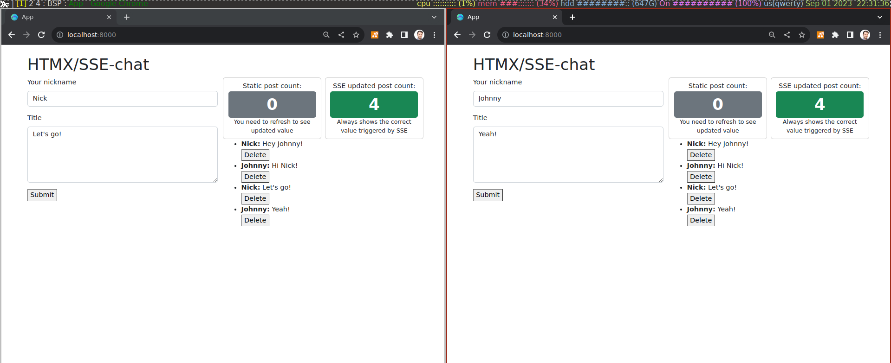

# Draft implementation `DBEvent`

*Sorry, this example uses my fork of IHP [kodeFant/ihp](https://github.com/kodeFant/ihp), so it won't get advantage of cachix.*

A proof of concept showing the usage of Server Sent Events to subscribe to database changes that can trigger JavaScript events like `autoRefresh`, but let's you customize the behaviour:

